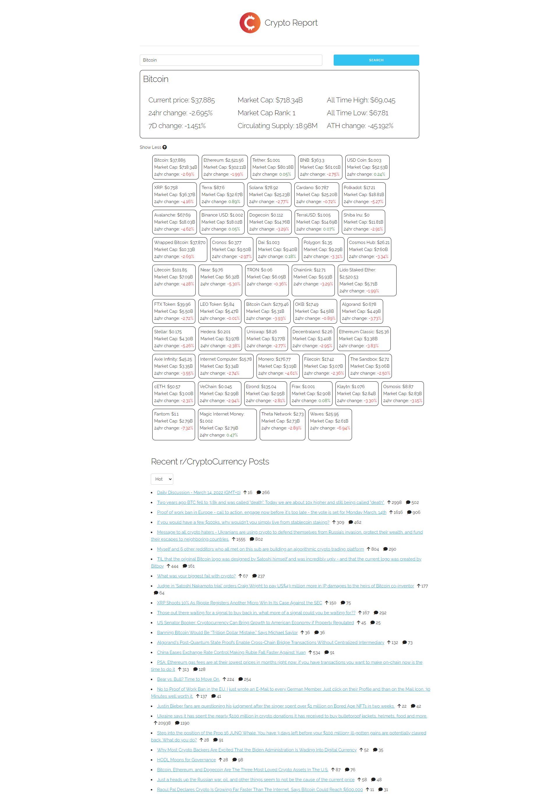

# Crypto Report

This application pulls in live data with cryptocurrenct prices and other information as well as live threads from reddit talking about cryptocurrency.

[Live link to application](https://jacksonnorris.github.io/bc-crypto-viewer/)

## Technologies Used

```

    Skeleton CSS
    CoinGecko API
    Reddit API

```

## Features

```

    Pulls in top 50 cryptocurrency prices using CoinGecko API to display price, market cap, and price change percentage over the last 24 hours
    Allows users to search for cryptocurrency to display more information on historical performance and market ranking
    Uses local storage to save what the user last searched for and will display persistently
    Uses Reddit API to pull in posts from r/cryptocurrency with number of upvotes, number of comments, and a link to thread
    Ability to sort Reddit posts by Hot, Top, and New

```

## Application Preview

The following image shows how the web application appears


